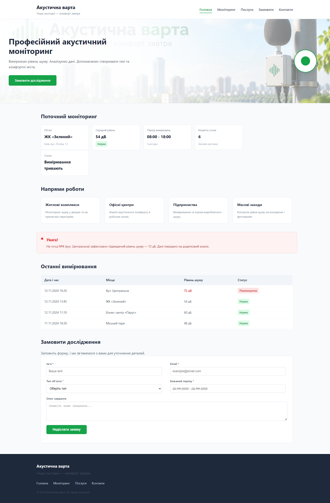

# Звіт з лабораторної роботи №2
**з дисципліни «Веб-програмування»**

**Тема:** Верстка сайту компанії згідно з інструкцією (HTML/CSS)  
**Студентка:** Юлія Гащук[span_2](start_span)[span_2](end_span)[span_3](start_span)[span_3](end_span)  

---

## 1. Мета роботи
Практично застосувати CSS для оформлення семантичної HTML-структури веб-сторінки: підключення зовнішнього CSS, селектори, каскад, specificity, типи блоків та Box Model.

---

## 2. Посилання на роботу
* **Опублікована сторінка на GitHub Pages:** [Лабораторна робота №2](https://yuhashchuk2023-5767.github.io/web-programming/lab_2/)
* **Репозиторій проекту:** [GitHub Repository](https://github.com/yuhashchuk2023-5767/web-programming)

---

## 3. Результат виконання
Нижче представлено скріншот розробленого сайту компанії «Акустична варта»:

---

## 4. Висновки
Під час виконання лабораторної роботи №2 було практично засвоєно:
1. Підключення зовнішньої таблиці стилів CSS за допомогою тегу `<link>`.
2. Використання різних типів селекторів: елементів, класів, ID, атрибутів та універсального селектора.
3. Принципи каскаду та специфічності (specificity) при виникненні конфліктів CSS-правил.
4. Застосування параметрів Box Model (`width`, `height`, `padding`, `border`, `margin`, `box-sizing: border-box`).
5. Роботу з блоковими та рядково-блоковими елементами (`display: inline-block`).
6. Відносне та абсолютне позиціонування (`position: relative` / `position: absolute`), а також плавність анімацій (`transition`) та трансформації (`transform`).