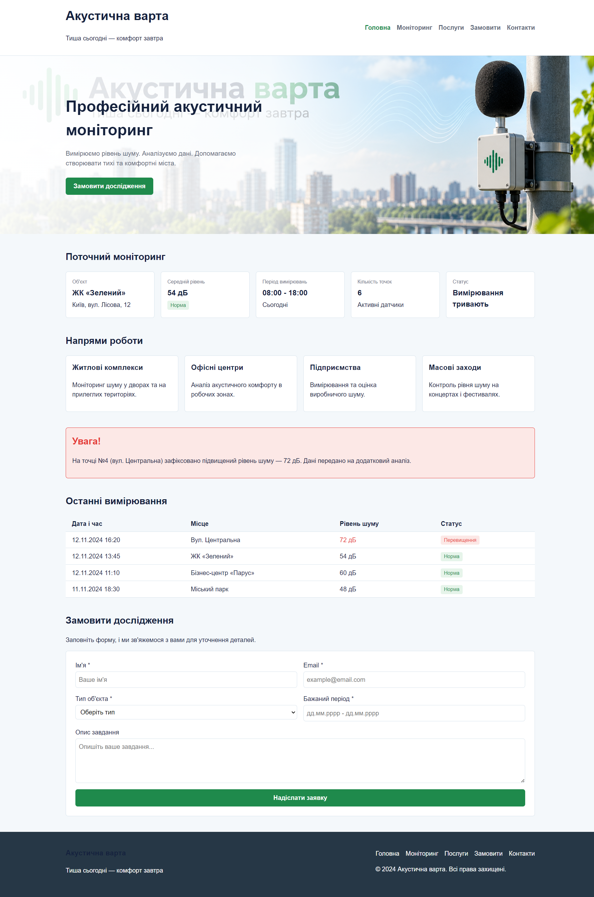

# Звіт з лабораторної роботи №3

**з дисципліни «Веб-програмування»**

**Тема:** Адаптивна верстка вебсторінки за допомогою Flexbox, CSS Grid та препроцесора SCSS  
**Студентка:** Юлія Гащук  

---

## 1. Мета роботи

Набути практичних навичок перетворення створеної HTML/CSS-сторінки на адаптивний інтерфейс із використанням препроцесора SCSS, Media Queries, Flexbox та CSS Grid, застосувавши принципи Responsive Design.

---

## 2. Посилання на роботу

* **Опублікована сторінка на GitHub Pages:** [Лабораторна робота №3](https://yuhashchuk2023-5767.github.io/web-programming/lab_3/)
* **Репозиторій проєкту:** [GitHub Repository](https://github.com/yuhashchuk2023-5767/web-programming/tree/main/lab_3)

---

## 3. Результат виконання

Нижче представлено скріншот адаптивного сайту компанії «Акустична варта», згортаного за допомогою SCSS, Flexbox та CSS Grid:

---

## 4. Висновки

Під час виконання лабораторної роботи №3 я засвоїла принципи побудови адаптивних веб-інтерфейсів за допомогою Flexbox та CSS Grid. Навчилася модульно організовувати стилі за допомогою препроцесора SCSS (змінні, nesting, міксини), виконувати їх автоматичну компіляцію у CSS та перевіряти чутливість макета до ширини екрана.