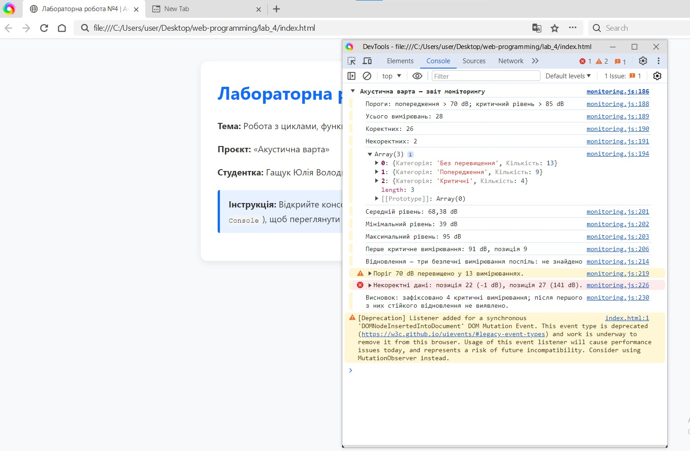

# Звіт з лабораторної роботи №4

**з дисципліни «Веб-програмування»**

**Тема:** Робота з циклами, функціями та функціональними виразами в JavaScript  

**Студентка:** Гащук Юлія Володимирівна (група КН-41)  

---

## 1. Мета роботи

Оволодіти практичними навичками роботи з циклами (`for`, `for...of`, `while`, `do...while`), оголошенням функцій у різній формі (Declaration, Expression, Arrow), обробкою некоректних даних та використанням синхронних callback-функцій на прикладі проєкту «Акустична варта».

---

## 2. Посилання на роботу

* **Опублікована сторінка на GitHub Pages:** [Лабораторна робота №4](https://yuhashchuk2023-5767.github.io/web-programming/lab_4/)
* **Код алгоритму (JS):** [monitoring.js на GitHub](https://github.com/yuhashchuk2023-5767/web-programming/blob/main/lab_4/js/monitoring.js)

---

## 3. Результат выполнения

Нижче представлено скріншот консолі розробника (DevTools -> Console) з виведеним підсумковим звітом алгоритму «Акустична варта»:

---

## 4. Висновки

Під час виконання лабораторної роботи №4 я:
1. Застосувала керуючі конструкції циклів (`for`, `for...of`, `while`, `do...while`) для обробки та фільтрації масиву даних.
2. Реалізувала декомпозицію логіки за допомогою три класичних видів функцій JavaScript (Function Declaration, Function Expression, Arrow Functions).
3. Використала передачу функції як параметра (callback) для гнучкого аналізу даних.
4. Сформувала структурований консольний звіт із використанням `console.group`, `console.table`, `console.warn` та `console.error`.