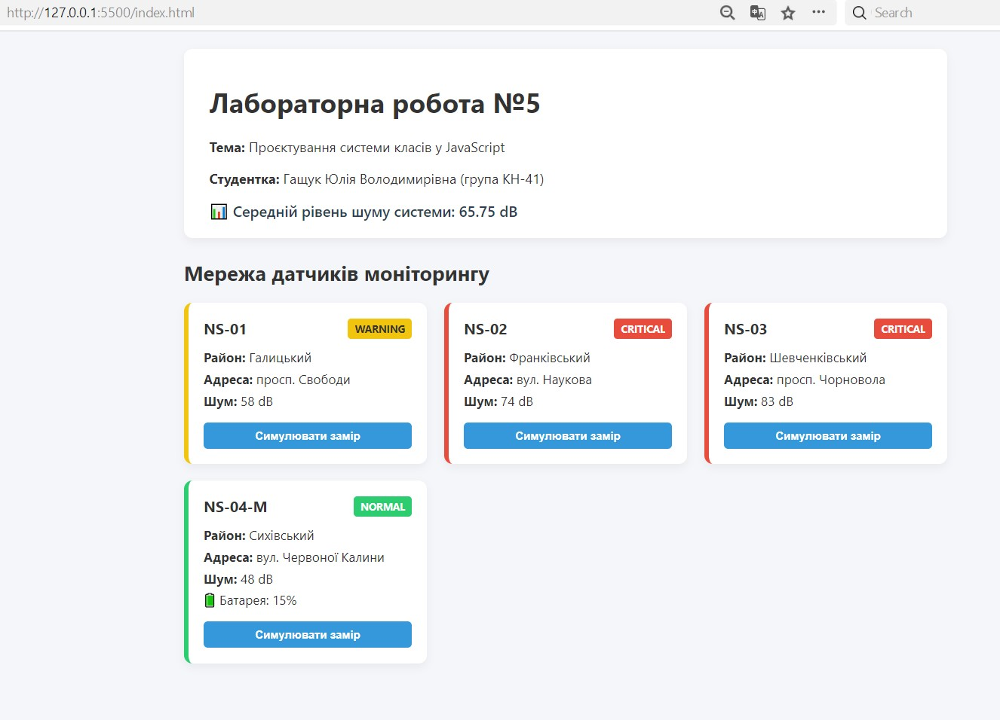
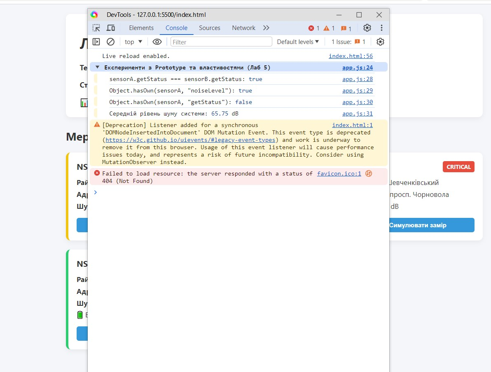

# Звіт з лабораторної роботи №5

**з дисципліни «Веб-програмування»**

**Тема:** Проєктування системи класів у JavaScript на прикладі навчального вебпроєкту «Акустична варта»  

**Студентка:** Гащук Юлія Володимирівна (група КН-41)  

---

## 1. Мета роботи
Перейти від набору окремих об’єктів та функцій до спроєктованої системи взаємопов’язаних класів, розмежувати їхні відповідальності, реалізувати композицію, наслідування та інтегрувати ООП-модель у наявний веб-інтерфейс.

---

## 2. Відповіді на контрольні питання

1. **Клас vs Екземпляр:** Клас — це шаблон або чертеж (опис властивостей та методів), а екземпляр — конкретний об'єкт у пам'яті, створений через `new`.
2. **this.noiseLevel vs getStatus():** `this.noiseLevel` належить конкретному об'єкту (власна властивість), а `getStatus()` знаходиться в `NoiseSensor.prototype` для економії пам'яті.
3. **Розміщення методів:** Метод у тілі `class` розміщується в `ClassName.prototype`.
4. **Спільне використання `getStatus`:** Два екземпляри посилаються на один і той самий метод через ланцюжок прототипів (`sensorA.getStatus === sensorB.getStatus`).
5. **Static-методи:** Використовуються, коли операція не залежить від стану конкретного екземпляра (наприклад, `NoiseSensor.isValidNoiseLevel(value)`).
6. **Композиція vs Наслідування:** Композиція (`MonitoringSystem -> NoiseSensor[]`) моделює відношення "містить", а наслідування (`MobileNoiseSensor extends NoiseSensor`) — "є різновидом".

## 3. Результати виконання та скріншоти

### Скріншот 1: Веб-інтерфейс системи «Акустична варта»
На скріншоті продемонстровано згенеровану мережу датчиків акустичного шуму з відповідними кольоровими індикаторами статусів (`NORMAL`, `WARNING`, `CRITICAL`), мобільний датчик із зарядом батареї, інтерактивні кнопки симуляції замірів та розрахований середній рівень шуму системи (65.75 dB).

---

### Скріншот 2: Консольні експерименти з Prototype та методами класів
На скріншоті видно результати виконання логіки у консолі розробника DevTools: перевірку прототипного ланцюжка (`sensorA.getStatus === sensorB.getStatus`), власних властивостей екземплярів (`Object.hasOwn`) та обчислення середнього рівня шуму.

---

## 4. Посилання на роботу

* **Опублікована сторінка на GitHub Pages:** [Лабораторна робота №5](https://yuhashchuk2023-5767.github.io/web-programming/lab_5/)
* **Репозиторій проєкту:** [GitHub Repository](https://github.com/yuhashchuk2023-5767/web-programming/tree/main/lab_5)